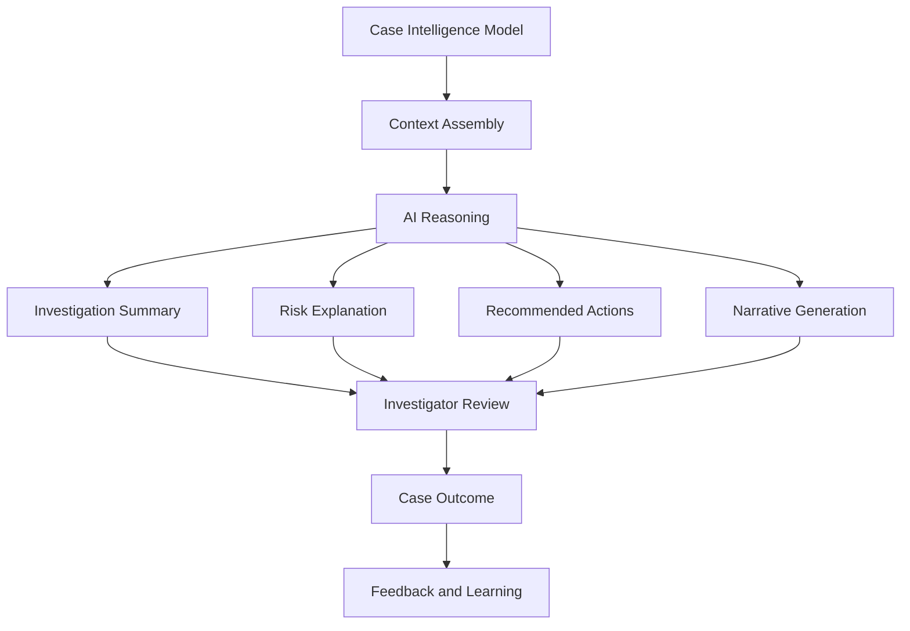

# 🕵️ AI Investigator Copilot

[← Back to Portfolio](https://dhartwig-fc.github.io/fc-01-portfolio-site/)

[LinkedIn](https://www.linkedin.com/in/dan-hartwig-financial-crime) | [GitHub Profile](https://github.com/dhartwig-fc)

---

## Overview

The AI Investigator Copilot is a prototype application demonstrating how AI can support Financial Crime investigators by enriching transaction monitoring alerts, explaining risk drivers and recommending investigative actions.

The solution acts as an intelligence layer above existing Financial Crime platforms, helping investigators understand alerts more quickly and consistently while keeping human decision-making and regulatory accountability at the centre of the process.

---

## Business Problem

Financial Crime investigators often review large volumes of alerts generated by Transaction Monitoring systems.

Investigators typically gather information from multiple sources, including:

- Transaction Monitoring platforms
- Customer Risk Assessments
- KYC repositories
- Adverse Media systems
- Network Analytics platforms
- Case Management solutions

This process can be manual, time-consuming and inconsistent.

---

## Prototype Objective

The objective of this prototype is to demonstrate how AI can:

- Summarise alerts
- Explain risk drivers
- Prioritise investigations
- Recommend next investigative actions
- Support case documentation
- Improve investigator productivity

---

## Current Functionality

### Alert Summary

Provides a concise overview of the alert, including:

- Customer
- Risk Score
- Alert Priority
- Counterparty Information

### Risk Driver Explanation

Identifies key factors contributing to alert risk, including:

- High-risk jurisdictions
- Transaction value anomalies
- New counterparties
- Adverse media indicators
- Network relationship risks

### Recommended Investigator Actions

Provides contextual guidance, including:

- KYC review
- Commercial rationale assessment
- Enhanced Due Diligence
- Escalation recommendations

---

## Example Workflow

```text
Transaction Monitoring Alert
            ↓
        Risk Scoring
            ↓
       AI Enrichment
            ↓
 Risk Driver Explanation
            ↓
   Investigator Guidance
            ↓
    Draft Case Narrative
            ↓
   Investigator Decision
```

---

## AI Investigator Copilot Lifecycle



---

## Capability Evolution Roadmap

| Version | Capability | Description |
|----------|------------|-------------|
| V1 | Risk Scoring Prototype | Rule-based scoring engine assessing transaction alerts against predefined risk indicators. |
| V2 | Alert Enrichment & Narrative Generation | Generates investigator-friendly explanations, risk summaries, recommended actions and draft case narratives. |
| V3 | Investigator Copilot Dashboard | Interactive Streamlit dashboard presenting alert summaries, risk drivers, investigator guidance and case narratives. |
| V4 | Dynamic Prompt Engineering | Alert-specific prompts generated dynamically using customer, counterparty and transaction context. |
| V5 | Multi-Risk Context Reasoning | Combines transaction monitoring, KYC, customer risk, adverse media, sanctions and network analytics signals into a unified reasoning framework. |

---

## Current Prototype Status

| Capability | Status |
|------------|---------|
| V1 Risk Scoring Prototype | ✅ Complete |
| V2 Alert Enrichment & Narrative Generation | ✅ Complete |
| V3 Investigator Copilot Dashboard | ✅ Complete |
| V4 Dynamic Prompt Engineering | 🔄 Planned |
| V5 Multi-Risk Context Reasoning | 🔄 Planned |

---

## Future Vision

Beyond the current Copilot capability, future development may include:

- Agentic Financial Crime Investigators
- Multi-Agent Investigation Workflows
- MCP-Based Financial Crime Toolkits
- Enterprise Financial Crime Operations Platforms
- Autonomous Investigation Preparation
- Cross-Domain AML, Sanctions, Fraud and TBML Operations

These capabilities are expected to be delivered through future repositories within the Financial Crime Analytics Showcase portfolio.

---

## Strategic Vision

This prototype demonstrates the evolution from traditional rule-based transaction monitoring towards an AI-enabled Financial Crime Investigator Copilot capable of enriching alerts, providing contextual reasoning, generating case documentation and supporting investigation workflows.

The capability acts as a bridge between Financial Crime Analytics, Network Intelligence and future AI-enabled investigation operating models.

---

## Navigation

### Previous Capability

⬅️ [Investigation Workflows](../01-network-intelligence/05-investigation-workflows/README.md)

### Related Portfolio Repositories

- Network Intelligence
- TBML Analytics
- Correspondent Banking Analytics
- Capital Markets Analytics

### Related Assets

📐 [Reference Architecture](./reference-architecture/README.md)

### Next Evolution

➡️ Agentic Financial Crime Investigator

➡️ MCP Financial Crime Toolkit

➡️ Enterprise Financial Crime Operations Platform

### Portfolio Home

🏠 [Financial Crime Analytics Showcase](../README.md)

---

## Key Message

The AI Investigator Copilot demonstrates how artificial intelligence can augment Financial Crime investigations by providing explainability, contextual reasoning and investigator support while maintaining human accountability and regulatory oversight.

It represents the transition from traditional alert review towards intelligence-led and AI-assisted Financial Crime Operations.
